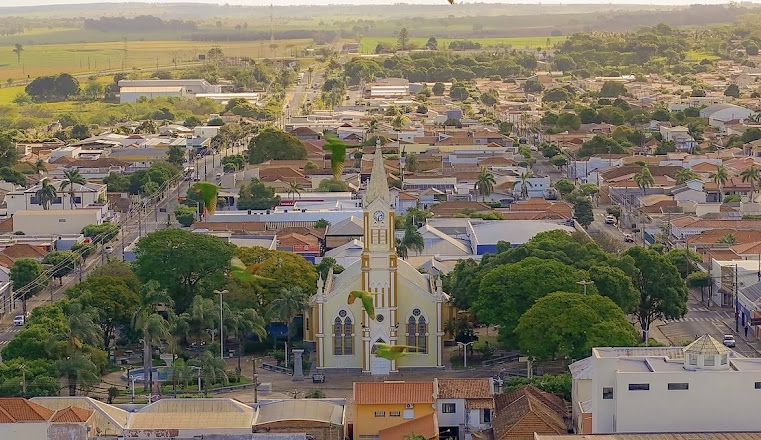

## Memorial acadêmico para professor titular {.center-text}
<!-- Esse título (#) tem que ficar aqui, antes do <style>, senão aparece um slide em branco. -->

<style>
:root {
  --cor1: #12355b;  /* azul profundo */
  --cor2: #006466;  /* azul arroxeado */
  --cor3: #4d194d;  /* roxo */
  --cor4: #7f1d1d;  /* magenta escuro */
  --cor5: #9a3412;  /* rosa escuro */
  --cor6: #365314;  /* coral forte */
  --cor7: #374151;  /* ocre escuro */
  --fundo: #f7f7f3;
}

.reveal { font-family: "Aptos", "Inter", "Arial", sans-serif; color: #222; }
.reveal .slides { text-align: left; }
.reveal section { padding-top: 20px; }
.reveal h1, .reveal h2, .reveal h3 { color: #17324d; letter-spacing: -0.02em; text-align: center;}
.reveal h1 { font-size: 1.75em; }
.reveal h2 { font-size: 1.35em; margin-top: 0.25em; }
.reveal p, .reveal li { font-size: 0.78em; line-height: 1.25; }
.reveal strong { color: #17324d; }
.small { font-size: 0.66em; color: #555; }
.note { font-size: 0.62em; color: #666; border-left: 4px solid #ccc; padding-left: 0.8em; }
.two-col { display: grid; grid-template-columns: 1.05fr 0.95fr; gap: 42px; align-items: start; }
.three-col { display: grid; grid-template-columns: repeat(3, 1fr); gap: 26px; }
.card { background: #f7f7f3; border-radius: 18px; padding: 24px 28px; border: 1px solid #e5e3da; }
.kpi { font-size: 1.45em; color: #17324d; font-weight: 700; }

/* Barra temporal superior */
.tl-wrap {
  position: relative;
  height: 88px;
  margin: 0 0 26px 0;
  padding: 0;
}
.tl-axis {
  position: absolute;
  left: 0;
  right: 0;
  top: 14px;
  height: 1px;
}
.tl-tick {
  position: absolute;
  top: -10px;
  transform: translateX(-50%);
  font-size: 0.43em;
  color: #666;
  white-space: nowrap;
}
.tl-tick::after {
  content: "";
  display: block;
  width: 1px;
  height: 8px;
  margin: 2px auto 0 auto;
  background: #b8b8b8;
}
.tl-periods {
  position: absolute;
  left: 0;
  right: 0;
  top: 34px;
  height: 32px;
}
.tl-period {
  position: absolute;
  height: 28px;
  border-radius: 999px;
  opacity: 0.42;
  color: white;
  font-size: 0.52em;
  line-height: 28px;
  text-align: center;
  overflow: hidden;
  white-space: nowrap;
}
.tl-period.active {
  opacity: 1;
  box-shadow: 0 0 0 3px rgba(23,50,77,0.15);
  font-weight: 700;
  color: white;
}

.tl-nasc { background: var(--cor1); }
.tl-ado { background: var(--cor2); }
.tl-grad { background: var(--cor3); }
.tl-pg { background: var(--cor4); }
.tl-pdoc { background: var(--cor5); }
.tl-cem { background: var(--cor6); }
.tl-furg { background: var(--cor7); }
.tl-cursor {
  position: absolute;
  top: 5px;
  height: 68px;
  width: 2px;
  background: #111;
  transform: translateX(-1px);
}
.tl-cursor-label {
  position: absolute;
  top: 66px;
  transform: translateX(-50%);
  font-size: 0.45em;
  font-weight: 700;
  color: #111;
  white-space: nowrap;
}
.timeline-caption {
  position: absolute;
  right: 0;
  top: 66px;
  font-size: 0.43em;
  color: #666;
}
.center-textp p {
  text-align: center;
}
.centro {
  text-align: center;
}
.direita {
  text-align: right;
}
</style>


```{r}
#| include: false
# Ajuste aqui os anos da trajetória e as fases da barra superior.
# A função usa HTML/CSS simples, sem dependências externas.

timeline <- function(year,
                     active = 1968,
                     start = 1968,
                     end = 2026,
                     show_caption = FALSE) {
  periods <- data.frame(
    label=c("Nascimento","Infância e adolescência em Brasília","Oceanologia", "Pós-graduação", "Pós-Doc","Professor CEM-UFPR", "Professor FURG"),
    key=c("nasc",   "ado",   "grad",   "pg",   "pdoc",   "cem",   "furg"),
    ini=c(1968,     1973,    1986,     1991,   2001,     2004,    2015),
    fim=c(1973,     1986,    1991,     2001,   2004,     2015,    2026),
    cls=c("tl-nasc","tl-ado","tl-grad","tl-pg","tl-pdoc","tl-cem","tl-furg"),
    stringsAsFactors = FALSE
  )

  pos <- function(x) 100 * (x - start) / (end - start)
  wid <- function(a, b) max(1, pos(b) - pos(a))

  if (is.null(active)) {
    idx <- which(year >= periods$ini & year <= periods$fim)
    active <- if (length(idx)) periods$key[idx[1]] else ""
  }

#BY é para os anos
  ticks <- seq(start, end, by = 2)
  tick_html <- paste0(
    sprintf('<div class="tl-tick" style="left: %.2f%%">%s</div>', pos(ticks), ticks),
    collapse = "\n"
  )

  period_html <- paste0(
    mapply(function(label, key, ini, fim, cls) {
      act <- ifelse(key == active, " active", "")
      sprintf('<div class="tl-period %s%s" style="left: %.2f%%; width: %.2f%%">%s</div>',
              cls, act, pos(ini), wid(ini, fim), label)
    }, periods$label, periods$key, periods$ini, periods$fim, periods$cls),
    collapse = "\n"
  )

  cap <- if (show_caption) '<div class="timeline-caption">anos e fase predominante</div>' else ''

  knitr::asis_output(paste0(
    '<div class="tl-wrap">',
    '<div class="tl-axis">', tick_html, '</div>',
    '<div class="tl-periods">', period_html, '</div>',
    sprintf('<div class="tl-cursor" style="left: %.2f%%"></div>', pos(year)),
    sprintf('<div class="tl-cursor-label" style="left: %.2f%%">%s</div>', pos(year), year),
    cap,
    '</div>'
  ))
}
```

<hr>
`r timeline(1968, active = "")`
<hr>

<br><br>

::: {.centro}
**Maurício Garcia de Camargo**  
<br>
Trajetória, contribuições e projeto acadêmico  
<br>
Universidade Federal do Rio Grande — FURG  
<br>
`r format(Sys.Date(), "%d/%m/%Y")`
:::

## Nascimento no interior de SP 
<hr>
`r timeline(1968, active = "nasc")`
<hr>
::: {.direita}
*E se lembrou de quando era uma criança.* 
<br>*E de tudo o que vivera até ali.*
:::

::: {.two-col}
::: {}
- Nasci em Rancharia (1968), interior de SP, onde vivi até os 4 anos de idade (1972).
- Meus pais eram filhos de pequenos comerciantes.
- Minhas avós eram imigrantes portuguesa e sírio-libanesa.  
- Meus avôs eram brasileiros de muitas gerações.
:::


:::


## Meus pais
<hr>
`r timeline(1968, active = "nasc")`
<hr>

:::{.incremental}
- Meu pai foi professor de matemática nato, desde adolescente.
- Com 18 anos ele passou num concurso do BB e tomou posse em Rancharia, onde vivia. 
- Conheceu minha mãe e se casaram com 21/22 anos e tiveram 3 filhos. Sou o mais novo. 
- Ela virou professora de matemática de escola.
- Ele se formou em matemática e economia pela UNESP e foi fazer mestrado em Brasília na UnB.
:::

## Mudança para Brasília
<hr>
`r timeline(1973, active = "ado")`
<hr>
<br><br>

- Início difícil para a família em Brasília.  
- Depois do mestrado, meu pai retornou ao BB, agora num cargo alto, e a vida melhorou.  
- Minha infância foi livre, muito livre.

:::{.note .centro}
*Por toda a plataforma*  
*Você não vê a torre, yeah!!!*
:::

## Mudança para Brasília
<hr>
`r timeline(1973, active = "ado")`
<hr>
:::{.small .centro}
*Meu Deus, mas que cidade linda...*
:::
<hr>

- Com 7/8 anos todos tinham o mapa de brasília na cabeça.  
- E podíamos passar debaixo da roleta dos ônibus...

## Estrutura narrativa do memorial

`r timeline(1986, active = "grad")`

::: {.two-col}
::: {.card}
**Eixo temporal**

A apresentação acompanha a trajetória por fases, sem fragmentar o memorial em uma simples sequência curricular.
:::

::: {.card}
**Eixo interpretativo**

Cada fase deve responder a três perguntas: o que foi aprendido, o que foi construído e que continuidade isso produziu.
:::
:::

1. Formação e base científica  
2. Consolidação em pesquisa, ensino e extensão  
3. Maturidade acadêmica e contribuição institucional  
4. Projeto para os próximos anos

## Formação inicial: Oceanologia

`r timeline(1991, active = "pg")`

::: {.two-col}
::: {}
- Graduação em Oceanologia pela FURG.
- Formação de base em oceanografia, ecologia marinha e métodos quantitativos.
- Primeiro contato com problemas integrados envolvendo organismos, sedimentos, água e processos costeiros.
:::

::: {.card}
**Mensagem da lâmina**

A graduação não aparece apenas como etapa inicial, mas como origem de uma forma integrada de olhar o ambiente marinho.
:::
:::

::: {.note}
Inserir aqui 2–3 marcos pessoais: iniciação científica, orientador(a), primeiro trabalho de campo, tema de monografia, primeiras publicações ou experiências laboratoriais.
:::
## Pós-graduação: especialização e ampliação conceitual

`r timeline(2001, active = "pdoc")`

::: {.two-col}
::: {}
- Mestrado em Zoologia pela UFPR.
- Mestrado em Ecologia Marinha Aplicada e Fundamental pela Universidade Livre de Bruxelas.
- Doutorado em Zoologia pela UFPR.
:::

::: {.card}
**Ênfase sugerida**

Mostrar a passagem de uma formação geral em oceanologia para uma atuação mais definida em ecologia bentônica, biodiversidade marinha, análise quantitativa e integração entre campo, laboratório e estatística.
:::
:::
## Primeira consolidação docente: CEM-UFPR

`r timeline(2004, active = "cem")`

::: {.two-col}
::: {}
- Ingresso como docente no Centro de Estudos do Mar da UFPR.
- Consolidação de disciplinas, projetos, orientações e redes de colaboração.
- Desenvolvimento de uma identidade acadêmica combinando ecologia marinha, estatística e formação de estudantes.
:::

::: {.card}
**Como apresentar**

Usar esta fase para mostrar crescimento institucional: criação de disciplinas, participação em cursos, coordenação de projetos, captação de recursos e formação de alunos.
:::
:::
## Transição e retorno institucional à FURG

`r timeline(2015, active = "furg")`

::: {.two-col}
::: {}
- Retorno à FURG como professor do Instituto de Oceanografia.
- Integração entre Oceanografia, Ecologia e Estatística aplicada.
- Atuação em ensino de graduação, pós-graduação, pesquisa, extensão e gestão acadêmica.
:::

::: {.card}
**Ideia central**

A transição pode ser apresentada como continuidade e reorientação: retorno ao ambiente formador, agora com experiência acumulada para contribuir com cursos, laboratórios, programas e políticas institucionais.
:::
:::
## Eixo 1 — Ensino

`r timeline(2020, active = "furg")`

::: {.three-col}
::: {.card}
**Graduação**

Disciplinas de base e disciplinas integradoras, com ênfase em raciocínio ecológico, estatístico e metodológico.
:::

::: {.card}
**Pós-graduação**

Formação avançada, orientação, delineamento de pesquisa, análise de dados e redação científica.
:::

::: {.card}
**Materiais e inovação**

Uso de R, Quarto, software livre, práticas de laboratório, atividades de campo e recursos didáticos reprodutíveis.
:::
:::

::: {.note}
Inserir números: disciplinas ministradas, alunos atendidos, orientações concluídas/em andamento, produtos didáticos, monitorias e inovações pedagógicas.
:::
## Eixo 2 — Pesquisa

`r timeline(2022, active = "furg")`

::: {.two-col}
::: {}
- Ecologia de invertebrados bentônicos.
- Oceanografia biológica e biogeoquímica marinha.
- Estatística ecológica, modelos, delineamento amostral e análise multivariada.
- Integração entre processos físicos, químicos e biológicos em ambientes costeiros e oceânicos.
:::

::: {.card}
**Sugestão visual**

Substituir este bloco por uma figura conceitual com três componentes: organismos bentônicos, ambiente físico-químico e métodos quantitativos.
:::
:::
## Eixo 3 — Orientação e formação de pessoas

`r timeline(2024, active = "furg")`

::: {.two-col}
::: {}
- Orientações em diferentes níveis de formação.
- Formação em campo, laboratório, análise de dados e escrita científica.
- Desenvolvimento de autonomia intelectual e rigor metodológico.
:::

::: {.card}
**Mensagem da lâmina**

O memorial deve explicitar que a produção acadêmica não se resume aos artigos, mas inclui a formação de pessoas capazes de formular perguntas, coletar dados, analisar evidências e comunicar resultados.
:::
:::
## Eixo 4 — Gestão, infraestrutura e contribuição institucional

`r timeline(2026, active = "furg")`

::: {.two-col}
::: {}
- Participação em comissões, colegiados, programas e ações institucionais.
- Organização de espaços de ensino, laboratórios, equipamentos e rotinas acadêmicas.
- Defesa de infraestrutura compartilhada, software livre e práticas reprodutíveis.
:::

::: {.card}
**Para fortalecer**

Apresente exemplos concretos: sala de informática, laboratórios, projetos pedagógicos, normas de uso, comissões, relatórios, avaliações e ações de extensão.
:::
:::
## Síntese da trajetória

`r timeline(2026, active = "furg")`

::: {.three-col}
::: {.card}
<div class="kpi">1</div>
**Base**  
Formação oceanográfica e ecológica.
:::

::: {.card}
<div class="kpi">2</div>
**Integração**  
Campo, laboratório, estatística e interpretação ambiental.
:::

::: {.card}
<div class="kpi">3</div>
**Contribuição**  
Ensino, pesquisa, orientação e construção institucional.
:::
:::
## Projeto acadêmico para os próximos anos

`r timeline(2026, active = "furg")`

::: {.two-col}
::: {}
- Consolidar materiais didáticos reprodutíveis e baseados em software livre.
- Fortalecer a integração entre Oceanografia, Ecologia, Biogeoquímica e Estatística.
- Ampliar redes de pesquisa e formação em ambientes costeiros, oceânicos e antárticos.
- Investir em infraestrutura laboratorial, computacional e metodológica.
:::

::: {.card}
**Frase de fechamento possível**

Minha trajetória indica uma convergência entre formação de pessoas, análise rigorosa de dados ambientais e compromisso institucional com a universidade pública.
:::
:::
## Como adaptar este modelo

`r timeline(2026, active = "furg")`

1. Ajuste os anos e fases no bloco `timeline()` no início do arquivo.  
2. Troque os textos genéricos por marcos pessoais e dados objetivos.  
3. Acrescente fotografias, mapas, capas de artigos, gráficos de produção e imagens de campo.  
4. Use a barra superior para manter a banca orientada temporalmente durante toda a apresentação.

::: {.note}
Para renderizar: salve como `memorial_timeline_revealjs.qmd` e rode `quarto render memorial_timeline_revealjs.qmd`.
:::
